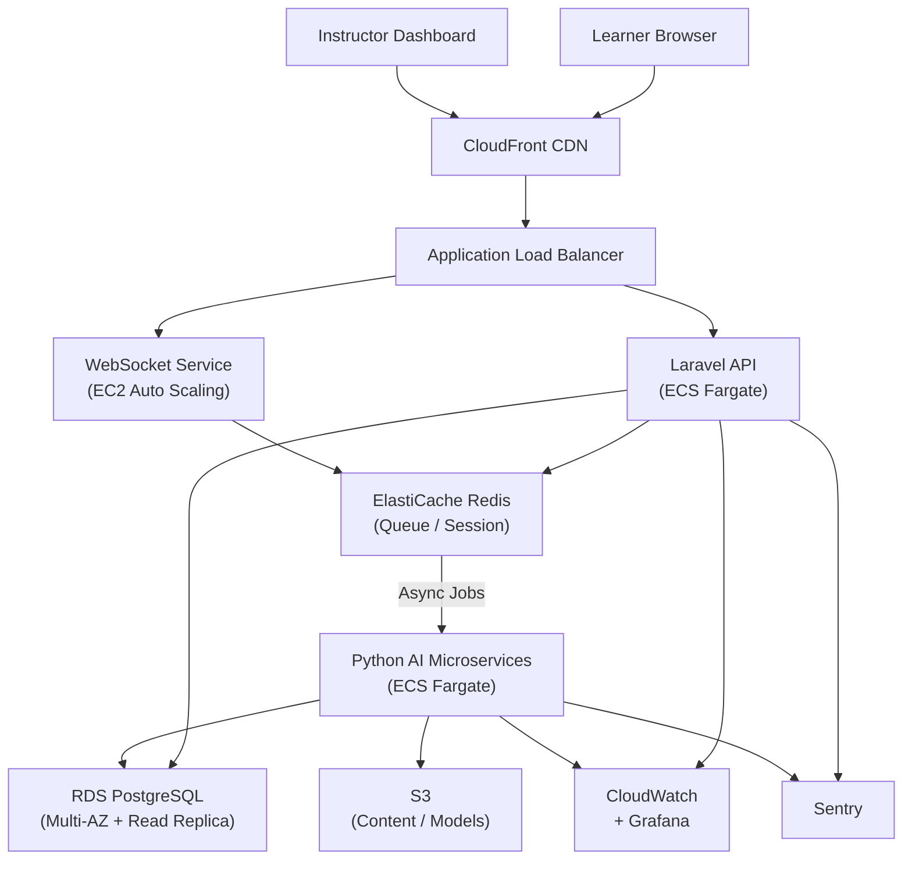

Traditional learning platforms deliver content. Intelligent learning platforms deliver outcomes.

In a recent project, HunterMussel engineered a next-generation **AI-powered Learning Management System (LMS)** designed to replace static course delivery with adaptive, data-driven learning experiences. The objective was clear: eliminate one-size-fits-all education logic and replace it with a system that learns how each student learns.

## Project Context

**Client:** Corporate training provider delivering compliance and technical certification programs (identity protected under NDA)
**Scale:** 5 active course tracks, approximately 240 enrolled learners per cohort, 8 instructors
**Engagement Duration:** 5 months from architecture to production launch
**Measurement Period:** Results measured across 3 consecutive training cohorts (approximately 5 months) post-deployment, compared to 3 cohorts run on the prior static LMS

## Development Investment

| | |
|---|---|
| **Total Estimated Hours** | ~380 h |
| **Rate** | $55 / hour |
| **Total Investment** | ~$20,900 |
| **Timeline at 20 h/week** | ~19 weeks (4.75 months) |
| **Timeline at 40 h/week** | ~9.5 weeks (2.5 months) |

**Phase breakdown:**

| Phase | Hours |
|---|---|
| Discovery, learning architecture & AI integration design | 30 h |
| Laravel core — courses, auth, permissions, multi-tenancy | 120 h |
| Python AI microservices (adaptive engine, NLP grading, forecasting) | 100 h |
| WebSocket real-time feedback service | 40 h |
| AWS infrastructure (Terraform, ECS, RDS Multi-AZ, S3, CloudFront) | 50 h |
| CI/CD pipeline (blue/green deployment, model validation jobs) | 20 h |
| Observability, model monitoring & alerting | 20 h |
| **Total** | **380 h** |

> The Python AI microservices phase is the most variable in scope. Integrating a third-party LLM API for NLP grading (rather than training a custom model) reduces this phase by ~30 hours and lowers cost accordingly.

## The Problem: Static Learning in a Dynamic World

Most LMS platforms share the same structural limitation — they treat all students identically. This causes three major inefficiencies:

1. **Uniform Content Delivery:** Every learner receives the same material regardless of pace, skill level, or comprehension.
2. **Manual Instructor Workload:** Grading, feedback, and progress tracking consume instructor time that could be used for mentoring.
3. **No Predictive Insight:** Traditional systems show what happened, but not what will happen next.

As course volume and student count grow, these limitations compound, creating administrative bottlenecks and reduced learning effectiveness.

<!-- truncate -->

## The Solution: A Three-Layer Intelligent Architecture

Instead of extending a traditional LMS with superficial AI widgets, we designed a modular intelligence layer integrated directly into the platform’s core.

### 1. Adaptive Learning Engine
We implemented a behavioral analysis module that tracks learner interactions — time spent per lesson, quiz accuracy, retry frequency, and navigation patterns. Using this data, the system dynamically adjusts:

- Content difficulty
- Lesson ordering
- Recommended exercises

The result is a personalized learning path generated in real time for each user.

### 2. Automated Assessment & Feedback
An AI evaluation pipeline processes assignments and quizzes instantly. For objective questions, grading is deterministic. For descriptive responses, an NLP model evaluates:

- Concept correctness
- Explanation clarity
- Logical reasoning structure

Students receive immediate feedback instead of waiting hours or days for instructor review.

### 3. Predictive Performance Analytics
Using historical engagement and performance metrics, a forecasting model identifies students at risk of failing before performance drops become visible.

Instructors receive alerts such as:

> "Student likely to miss certification threshold within 5 sessions."

This allows proactive intervention rather than reactive remediation.

## Technical Architecture

The platform was designed with extensibility and scalability as first-class principles.

**Core Stack**
- Backend: Laravel (modular service architecture)
- AI Services: Python microservices for model execution
- Database: PostgreSQL with event-tracking tables
- Queue System: Redis for async evaluation and predictions
- Realtime Layer: WebSockets for instant feedback updates

**AI Integration Layer**
The LMS communicates with AI services through an internal API gateway that handles:

- Model routing
- Versioning
- Load balancing
- Rate control

This separation ensures that AI models can be updated or replaced without modifying the core platform.

## Infrastructure & Deployment

The platform was deployed on AWS with clearly separated services for the LMS core, AI processing layer, and real-time feedback engine.

**Cloud Provider:** AWS
**Compute:** ECS Fargate for Laravel API and Python AI microservices; EC2 Auto Scaling group for WebSocket service
**Database:** Amazon RDS (PostgreSQL Multi-AZ) with read replicas for analytics queries
**Cache & Queue:** Amazon ElastiCache (Redis) for job dispatching and session caching
**Object Storage:** S3 for course content, video assets, and trained model binaries
**CDN:** CloudFront for media delivery and frontend assets
**Networking:** VPC with private subnets isolating AI services from public traffic
**Secrets:** AWS Secrets Manager for model API credentials and DB connection strings

**Deployment Pipeline**
- GitHub Actions CI/CD with linting, unit, and integration test stages
- Docker images tagged per commit and stored in ECR
- ECS blue/green deployments for zero-downtime releases
- Terraform manages all infrastructure resources; state stored in S3 with DynamoDB locking

## Observability & Monitoring

The LMS handles real learner outcomes, making observability critical. Grading errors or silent model failures must be detected immediately.

**Metrics:** CloudWatch container-level metrics with custom namespace for AI inference latency
**Error Tracking:** Sentry for PHP (Laravel) and Python service exceptions
**Dashboards:** Grafana with panels for queue depth, grading throughput, and model prediction confidence
**Log Aggregation:** CloudWatch Logs with structured logging; log groups per service environment
**Alerting:** PagerDuty escalation policy for queue saturation, grading failures, and WebSocket disconnects
**Model Monitoring:** Nightly job validating NLP grading accuracy on a labeled validation set; results written to CloudWatch custom metrics

Key dashboards tracked:
- Evaluation queue depth and processing rate
- NLP grading latency (p50, p95)
- WebSocket active connections and reconnect rate
- At-risk student alert delivery rate

## Infrastructure Diagram

## The Impact: Measurable Learning Gains

After deployment across three consecutive training cohorts (720+ learners), measurable improvements emerged compared to the same courses run on the prior static LMS:

- **41% Faster Course Completion:** Average completion time dropped from 34 days to 20 days as adaptive sequencing removed redundant content for proficient learners.
- **63% Reduction in Instructor Grading Time:** Automated evaluation handled 81% of all assessment submissions, freeing instructors from approximately 14 hours of weekly grading per course track.
- **34% Lower Dropout Rate for At-Risk Learners:** Predictive alerts triggered proactive instructor outreach, reducing the at-risk student dropout rate from 22% to 14.5% per cohort.

## Why Laravel Was the Right Choice

Laravel provided a strong foundation for rapid iteration and structured growth:

- Mature ecosystem for authentication, permissions, and multi-tenancy
- Clean architecture patterns that simplify feature expansion
- Queue and job systems ideal for AI processing workflows
- Strong ORM for complex relational learning data

Instead of fighting the framework, the architecture leveraged its strengths to accelerate development.

## Conclusion: Learning Platforms Should Learn Too

An LMS should not be a content repository. It should be an adaptive system that continuously improves how knowledge is delivered and absorbed.

By embedding intelligence directly into the platform’s architecture, this implementation transformed a traditional LMS into a system that observes, predicts, and adapts — reducing manual workload while improving learning outcomes.

---

**Want to turn your platform into an intelligent system instead of a static tool?**

HunterMussel builds AI-native platforms designed for automation, prediction, and scale.

[**Schedule a Technical Consultation**](https://huntermussel.com/#contact)