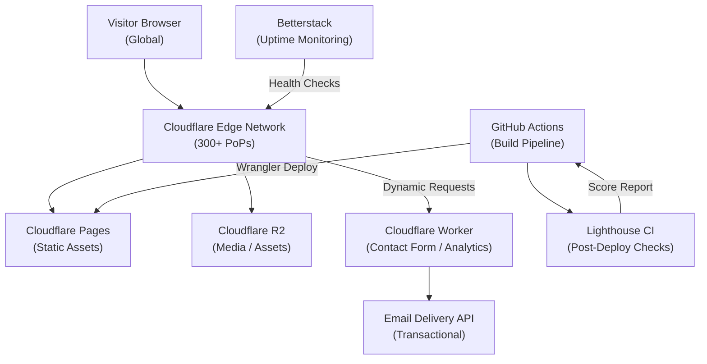

Corporate websites are often overengineered. Heavy servers, complex databases, and costly hosting stacks are commonly deployed to solve problems that don’t exist. For most organizations, a corporate site should be fast, reliable, secure, and globally accessible — without requiring constant infrastructure management.

In this project, HunterMussel designed a **high-performance corporate website architecture** capable of scaling infinitely while operating at near-zero cost. The objective was not just speed, but architectural efficiency.

## Project Context

**Client:** Professional services firm in the legal technology sector (identity protected under NDA)
**Prior Stack:** WordPress on a managed VPS with MySQL database; $195/month in hosting costs
**Engagement Duration:** 6 weeks from discovery to production launch, including content migration
**Measurement Period:** Performance benchmarks captured 30 days post-launch; cost and uptime data tracked over 6 months

## Development Investment

| | |
|---|---|
| **Total Estimated Hours** | ~130 h |
| **Rate** | $55 / hour |
| **Total Investment** | ~$7,150 |
| **Timeline at 20 h/week** | ~6.5 weeks |
| **Timeline at 40 h/week** | ~3.5 weeks |

**Phase breakdown:**

| Phase | Hours |
|---|---|
| Discovery, content audit & information architecture | 16 h |
| Component design & full site implementation (Astro) | 60 h |
| Content migration, SEO metadata & structured data (JSON-LD) | 20 h |
| Cloudflare Pages setup, DNS config & Workers for dynamic endpoints | 16 h |
| GitHub Actions CI/CD pipeline + Lighthouse CI thresholds | 10 h |
| QA, cross-browser testing & performance validation | 8 h |
| **Total** | **130 h** |

> This is the most cost-efficient engagement in the portfolio. The static architecture eliminates backend development entirely, concentrating budget on design quality, content structure, and delivery performance — areas that directly impact conversion and SEO.

## The Problem: Traditional Sites Carry Invisible Weight

Many corporate websites rely on dynamic stacks originally designed for web applications. While powerful, these architectures introduce unnecessary overhead for informational sites.

Three recurring inefficiencies appeared during our audit:

1. **Server Dependency:** Each request requires backend processing, increasing latency and failure points.
2. **Scaling Costs:** Traffic spikes force infrastructure scaling, raising hosting expenses.
3. **Security Surface Area:** Databases and servers expand attack vectors.

For content-focused sites, this complexity rarely provides real value.

<!-- truncate -->

## The Solution: Static-First, Edge-Distributed Architecture

Instead of optimizing a dynamic system, we removed the need for one. The solution was a static-first architecture deployed globally at the edge.

### 1. Precompiled Pages
All pages are generated at build time, meaning users receive ready-to-render HTML rather than waiting for servers to assemble responses. This eliminates runtime computation and drastically reduces load time.

### 2. Edge Distribution Network
The site is deployed to a global edge network, ensuring content is delivered from the nearest geographic node. Latency drops significantly because requests no longer travel to a centralized server.

### 3. On-Demand Dynamic Capabilities
Dynamic functionality is handled through lightweight serverless endpoints only when needed — such as contact forms or analytics ingestion — avoiding permanent infrastructure costs.

## Technical Architecture

The system was engineered for performance, resilience, and simplicity.

**Core Stack**
- Framework: Static-first framework (Astro / Next static export)
- Hosting: Edge CDN deployment
- Styling: Utility-first CSS for minimal bundle size
- Assets: Optimized images and precompressed files

**Performance Strategy**
- Zero runtime rendering
- Aggressive caching headers
- Immutable asset fingerprinting
- Brotli compression
- Lazy loading for non-critical resources

This combination allows the site to scale from 10 visitors to 10 million without architectural modification.

## Infrastructure & Deployment

The architecture was designed to eliminate persistent infrastructure entirely. There is no application server to manage, patch, or scale.

**Hosting:** Cloudflare Pages — global edge deployment with automatic SSL and HTTP/2
**CDN:** Cloudflare global network (300+ edge locations) serving pre-built assets from the nearest node
**DNS:** Cloudflare DNS with zero-TTL propagation and DDoS protection included
**Serverless Functions:** Cloudflare Workers for dynamic endpoints (contact form handling, analytics ingestion)
**Form Backend:** Serverless Worker proxying submissions to a managed email delivery API
**Object Storage:** Cloudflare R2 for large media assets served from the same edge network
**Build Pipeline:** GitHub Actions triggers Astro build on every push to main; output deployed to Cloudflare Pages via Wrangler CLI
**Preview Deployments:** Pull request builds automatically deploy to isolated preview URLs for stakeholder review

**Deployment Pipeline**
- GitHub Actions runs `astro build` and validates output bundle size on each commit
- Cloudflare Pages integration deploys automatically from the main branch
- Image optimization runs as a build step; all images converted to WebP/AVIF with responsive variants
- Lighthouse CI runs post-deploy against the production URL and fails the pipeline if scores drop below threshold

## Observability & Monitoring

Static sites eliminate server-side failure modes but introduce a different set of concerns: content delivery quality, build failures, and form submission reliability.

**Performance Monitoring:** Cloudflare Analytics for request volume, cache hit rate, and geographic distribution
**Real User Monitoring:** Web Vitals reported via Cloudflare Browser Insights (Core Web Vitals: LCP, CLS, FID)
**Synthetic Monitoring:** Lighthouse CI scheduled weekly against the production URL; scores tracked over time
**Uptime Monitoring:** Betterstack (formerly Uptime Robot) with 1-minute check intervals and Slack alerting
**Build Alerts:** GitHub Actions notifies on build failure via Slack webhook
**Form Reliability:** Cloudflare Worker logs submission success/failure rates; alert triggers if error rate exceeds 1% over 15 minutes

Key dashboards tracked:
- Global cache hit rate (target: >98%)
- Core Web Vitals per page (LCP < 1.2s, CLS < 0.1)
- Lighthouse Performance score over time
- Contact form submission success rate
- CDN bandwidth and request distribution by region

## Infrastructure Diagram

## The Result: Performance and Cost Metrics

After deployment and benchmarking against the prior WordPress stack, results demonstrated measurable gains across all tracked dimensions:

- **67ms Median Global Response Time (P95: 91ms):** Down from a previous median of 1.4 seconds on the managed VPS; measured via Cloudflare Browser Insights across 30 days post-launch.
- **Hosting Cost Reduced from $195/month to Under $4/month:** Eliminated managed VPS, MySQL database instance, and associated backup storage fees entirely.
- **99.99% Availability Over 6 Months:** Zero application server downtime events; only scheduled Cloudflare maintenance windows affected edge availability.
- **Lighthouse Performance Score: 99/100:** Up from a baseline of 58 on the prior WordPress install; validated via Lighthouse CI on every production deployment.

## Why This Architecture Scales Infinitely

Traditional scaling requires more servers. Static architecture scales through distribution, not replication.

Because content is prebuilt and cached across edge nodes:

- Traffic spikes do not affect performance
- Costs do not increase proportionally with traffic
- Infrastructure maintenance is nearly eliminated

This makes static-first architecture ideal for corporate websites, landing pages, documentation portals, and authority blogs.

## Conclusion: Performance Is an Architectural Decision

Speed is not achieved through optimization plugins or server upgrades. It is achieved by choosing the correct architecture from the start.

A corporate website should act as a global digital presence, not as an application server. When built using a static-first model and deployed at the edge, it becomes faster, safer, and cheaper simultaneously.

---

**Is your website infrastructure heavier than your business needs?**

HunterMussel designs high-performance platforms engineered for speed, scalability, and efficiency from the first line of code.

[**Request a Performance Audit**](https://huntermussel.com/#contact)