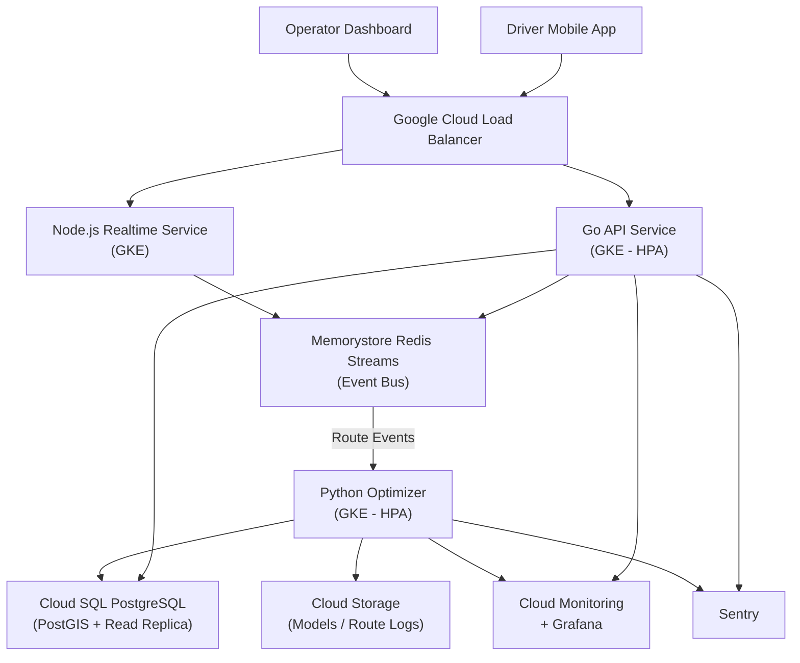

Scaling a delivery operation is not a matter of adding drivers. It is a matter of optimizing decisions. As order volume increases, the complexity of routing grows exponentially, and manual coordination becomes mathematically inefficient.

In this project, HunterMussel developed a **real-time route optimization engine** embedded inside a delivery platform designed to orchestrate drivers, orders, and traffic conditions dynamically. The goal was to eliminate wasted mileage, reduce delivery time, and maintain operational efficiency even during demand spikes.

## Project Context

**Client:** Regional last-mile delivery operator (identity protected under NDA)
**Scale:** 48 active drivers across 3 metro delivery zones; approximately 900 orders per day at peak
**Engagement Duration:** 5 months from discovery to production launch
**Measurement Period:** Results tracked over 90 days post-launch against a 90-day pre-deployment baseline

## The Challenge: Logistics Complexity Grows Faster Than Volume

When analyzing the client’s system, three structural limitations emerged:

1. **Static Routing Logic:** Routes were defined once and rarely recalculated, ignoring real-time traffic and order changes.
2. **Dispatcher Bottleneck:** Human operators were responsible for assigning deliveries, limiting scalability.
3. **Route Collision:** Drivers frequently covered overlapping areas at different times, increasing fuel consumption and delivery latency.

As the fleet expanded, these issues compounded, leading to rising costs and inconsistent service quality.

<!-- truncate -->

## The Solution: Real-Time Optimization Engine

Instead of improving dispatch workflows incrementally, we redesigned the routing logic as an automated decision system capable of recalculating optimal routes continuously.

### 1. Dynamic Route Computation
We implemented a routing algorithm inspired by combinatorial optimization models similar to the Traveling Salesperson Problem, adapted for live constraints such as:

- Traffic updates
- Order priority
- Driver location
- Delivery windows
- Vehicle capacity

Routes are recalculated every time new input enters the system, ensuring decisions remain optimal at all times.

### 2. Predictive Driver Positioning
A forecasting module analyzes historical demand patterns and predicts where orders are likely to appear. Drivers are strategically positioned in advance, reducing idle time and improving pickup speed.

### 3. Autonomous Dispatch Layer
An automation agent manages assignment logic. When a new order arrives, the system:

1. Evaluates all active drivers
2. Simulates route impact scenarios
3. Selects the assignment with the lowest total cost function
4. Updates downstream routes instantly

No dispatcher intervention is required unless manual override is triggered.

## System Architecture

The platform was built with modularity and high concurrency in mind.

**Core Stack**
- API Layer: Go for low-latency processing
- Realtime Engine: Node.js event services
- Optimization Models: Python microservices
- Messaging: Redis streams for event-driven updates
- Database: PostgreSQL with geospatial indexing

**Optimization Logic Pipeline**
Input data flows through a decision pipeline:

1. Event ingestion
2. Constraint evaluation
3. Route simulation
4. Cost scoring
5. Optimal route selection
6. Live update broadcast

This architecture ensures the system reacts instantly to operational changes.

## Infrastructure & Deployment

The platform was built on Google Cloud Platform (GCP) with Kubernetes to handle high-concurrency routing workloads and enable rapid horizontal scaling during demand spikes.

**Cloud Provider:** GCP
**Compute:** Google Kubernetes Engine (GKE) for all services; HPA (Horizontal Pod Autoscaler) on the Go API and Python optimizer pods
**Database:** Cloud SQL (PostgreSQL) with PostGIS extension for geospatial indexing; read replicas for analytics
**Messaging:** Redis Streams on Memorystore for event-driven route updates
**Object Storage:** Google Cloud Storage for optimization model checkpoints and historical route logs
**CDN:** Cloud CDN for operator dashboard assets
**Networking:** VPC-native GKE cluster; internal load balancer separating the optimization service from public endpoints
**Secrets:** Google Secret Manager for database credentials and external map API keys

**Deployment Pipeline**
- GitHub Actions CI/CD with Go unit tests, Python model validation, and integration tests against a staging GKE namespace
- Container images built with Cloud Build and stored in Artifact Registry
- Helm charts per service; promoted from staging to production via ArgoCD GitOps
- Terraform provisions GKE, Cloud SQL, and Memorystore; modules maintained per environment

## Observability & Monitoring

Route optimization failures are immediate and visible to drivers and customers. The observability stack was designed for real-time incident response.

**Metrics:** Google Cloud Monitoring with custom metrics for route recalculation latency and dispatch decision time
**Dashboards:** Grafana connected to Cloud Monitoring and Prometheus scrape endpoints in GKE
**Error Tracking:** Sentry for Go API panics and Python optimizer exceptions
**Log Aggregation:** Cloud Logging with structured JSON logs; log-based alerting for critical error rates
**Alerting:** PagerDuty with escalation policies for route computation failures, Redis stream consumer lag, and database replica lag
**Performance Regression Detection:** Automated benchmark job runs on every Python model deployment comparing p95 optimization latency against baseline

Key dashboards tracked:
- Route recalculation rate (recalculations/min)
- Optimization decision latency (p50, p95, p99)
- Active driver WebSocket connections
- Redis stream consumer lag per service group
- Fleet utilization percentage over time

## Infrastructure Diagram

## Performance Results

After production deployment, operational metrics demonstrated clear improvements against the 90-day pre-launch baseline:

- **28% Reduction in Total Mileage:** Average daily fleet mileage dropped from 4,100 km to 2,950 km across the same order volume.
- **37% Faster Deliveries:** Median delivery time fell from 52 minutes to 33 minutes per order.
- **23% Reduction in Driver Idle Time:** Predictive positioning cut average inter-assignment idle time from 18 minutes to 14 minutes per shift.
- **Operational Scalability:** The platform handled 5× order volume (from ~180 to ~900 orders/day) without adding dispatch staff or degrading route quality.

## Why Real-Time Optimization Matters

Logistics systems are dynamic environments. Static algorithms become obsolete seconds after execution because new variables continuously appear.

Real-time optimization converts logistics into a feedback loop:

- Input changes
- System recalculates
- Decisions improve
- Efficiency compounds

This continuous recalculation is what allows delivery platforms to scale sustainably.

## Conclusion: Logistics Is a Computation Problem

Delivery operations are not primarily a transportation challenge. They are a decision optimization challenge.

By replacing manual routing with an automated decision engine, the platform transformed logistics from reactive coordination into predictive orchestration — reducing cost, improving speed, and enabling growth without proportional operational expansion.

---

**Is your delivery system scaling in complexity faster than revenue?**

HunterMussel builds intelligent logistics platforms designed to automate decisions, optimize routes, and scale operations without friction.

[**Request a Logistics System Audit**](https://huntermussel.com/#contact)