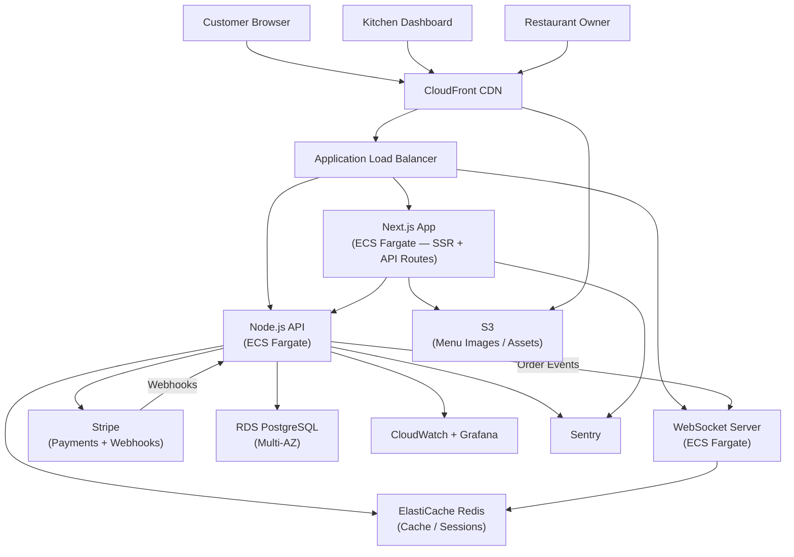

Every time a restaurant accepts an order through iFood or Rappi, they pay a cut. Somewhere between 20% and 30%, depending on the plan. On top of that, they don't own the customer relationship — the platform does. The restaurant becomes a supplier in someone else's marketplace.

That's the problem [Horadolanche](https://horadolanche.com) was built to solve. We designed and shipped a **multi-tenant SaaS delivery platform** that gives restaurants their own branded ordering channel — direct checkout, no commissions, full customer data ownership.

## Product Overview

**Product:** Horadolanche — SaaS web app for restaurant delivery
**Built by:** HunterMussel (our own product, not a client project)
**Target:** Restaurants and food businesses that want a direct ordering channel
**Stack:** Next.js (App Router), React, Node.js, PostgreSQL, Stripe
**Status:** In production and actively onboarding restaurants

## Development Investment

| | |
|---|---|
| **Total Estimated Hours** | ~380 h |
| **Rate** | $55 / hour |
| **Total Investment** | ~$20,900 |
| **Timeline at 20 h/week** | ~19 weeks |
| **Timeline at 40 h/week** | ~9.5 weeks |

**Phase breakdown:**

| Phase | Hours |
|---|---|
| Discovery, product architecture & UX design | 40 h |
| Next.js storefront — multi-tenant routing, SSR pages | 80 h |
| Node.js API — orders, menus, restaurants, auth | 90 h |
| Real-time layer (WebSockets) — live order status | 30 h |
| Stripe payment integration & webhook handling | 25 h |
| Admin & kitchen dashboards | 45 h |
| AWS infrastructure (Terraform, ECS, RDS, ElastiCache) | 35 h |
| CI/CD pipeline, observability setup | 20 h |
| QA, integration testing & production launch | 15 h |
| **Total** | **380 h** |

## The Problem: Third-Party Platforms Own Your Customer

Restaurants that rely exclusively on aggregator platforms face three structural problems that don't go away as they grow — they compound.

1. **Commission Drain:** Every order placed through iFood or Rappi costs the restaurant 20–30% of the order value. A restaurant doing R$50,000/month in delivery revenue is paying up to R$15,000 of that directly to a platform.
2. **No Customer Data:** The customer belongs to the aggregator. The restaurant can't retarget them, run loyalty programs, or even know their email address. Repeat business flows through the platform, not through the restaurant.
3. **Zero Brand Presence:** The ordering experience is the aggregator's UI. The restaurant is just a listing among hundreds. There's no consistent brand moment between placing the order and the food arriving.

These aren't platform quirks. They're the business model. The aggregator's incentive is to own the customer relationship, not to help restaurants build one.

<!-- truncate -->

## The Solution: A Direct Ordering Channel Restaurants Actually Own

Instead of building another aggregator, we built the infrastructure restaurants use to run their own channel.

### 1. Multi-Tenant Branded Storefronts

Each restaurant on Horadolanche gets their own storefront — their own URL, their own colors, their own menu structure. Customers order directly from the restaurant's branded page, not from a marketplace listing.

Multi-tenancy is handled at the routing layer in Next.js App Router. Each subdomain resolves to a specific restaurant's configuration, and all pages are server-side rendered for SEO — so a restaurant's storefront can rank in Google for local searches like "pizza delivery [neighborhood]".

### 2. Real-Time Order Management

When an order comes in, the kitchen sees it immediately. The platform pushes live updates via WebSockets — new orders appear on the kitchen dashboard without polling, and order status changes (confirmed, preparing, out for delivery) propagate back to the customer in real time.

Restaurant owners get a separate management interface to control menu items, categories, availability, and operating hours — no developer needed.

### 3. Direct Checkout, No Middleman

Payments go through Stripe, charged directly to the customer and settled to the restaurant's account. There's no Horadolanche commission per transaction — restaurants pay a flat SaaS subscription instead of a percentage of every order. For a restaurant doing any meaningful delivery volume, the math is straightforward.

Stripe webhooks handle payment confirmation and feed the order pipeline. Failed payments, refunds, and disputes are managed through the same integration.

## System Architecture

**Core Stack**
- Frontend: Next.js 14 (App Router) — SSR storefronts, React Server Components
- API: Node.js — order processing, menu management, restaurant config, auth
- Database: PostgreSQL — orders, menus, users, restaurant data
- Real-time: WebSocket server — live order status for kitchen and customer
- Payments: Stripe — checkout sessions, webhooks, payout management
- Cache: Redis — session storage, menu caching, rate limiting

**Request Flow: Customer Placing an Order**
1. Customer visits restaurant subdomain — Next.js SSR renders storefront from cached restaurant config
2. Customer builds cart and proceeds to checkout
3. Stripe checkout session created via Node.js API
4. Payment confirmed via Stripe webhook
5. Order written to PostgreSQL, pushed to kitchen dashboard via WebSocket
6. Order status updates from kitchen flow back to customer in real time

## Infrastructure & Deployment

**Cloud Provider:** AWS
**Compute:** ECS Fargate for the Next.js app and Node.js API as separate services; independent autoscaling per service
**Database:** Amazon RDS (PostgreSQL Multi-AZ); connection pooling via PgBouncer on the API service
**Cache & Sessions:** Amazon ElastiCache (Redis) for menu caching, session management, and WebSocket state
**Object Storage:** S3 for restaurant assets — logos, menu item photos; served through CloudFront
**CDN:** CloudFront for storefront static assets and menu images; edge caching reduces latency for restaurant storefronts
**Networking:** VPC with private subnets for database and cache tiers; Application Load Balancer handles subdomain routing to the Next.js service
**Secrets:** AWS Secrets Manager for database credentials, Stripe API keys, and JWT signing secrets

**Deployment Pipeline**
- GitHub Actions CI/CD with Jest unit tests and Playwright end-to-end tests covering the order placement flow
- Docker images built and pushed to ECR; ECS rolling deployments with health checks
- Terraform manages all infrastructure per environment (staging mirrors production)
- Database migrations run as a pre-deploy ECS task before traffic shifts

## Observability & Monitoring

A failed order is the worst user experience a delivery platform can produce. The observability setup prioritizes order pipeline failures above everything else.

**Metrics:** CloudWatch custom metrics for order creation rate, payment success rate, WebSocket connection count, and Stripe webhook processing latency
**Error Tracking:** Sentry for Next.js server errors, Node.js API exceptions, and Stripe webhook failures
**Dashboards:** Grafana panels for order throughput, API response times (p50, p95), WebSocket connection health, and Redis cache hit rates
**Log Aggregation:** CloudWatch Logs with structured JSON; order lifecycle events logged with restaurant ID, order ID, and status transitions for debugging
**Alerting:** PagerDuty for payment webhook failures, API error rate spikes, and database connection pool exhaustion

Key dashboards tracked:
- Order creation success rate (target: > 99.5%)
- Stripe webhook processing latency (p95 target: < 2s)
- WebSocket connection stability per restaurant
- Menu cache hit rate (target: > 90%)
- API response latency p50 and p95

## Infrastructure Diagram

## Platform Capabilities

Horadolanche launched with everything a restaurant needs to run a delivery operation independently.

- **Branded storefront per restaurant** — custom subdomain, logo, colors, and menu layout; no Horadolanche branding in the customer experience
- **Server-side rendered pages** — each storefront is fully crawlable by Google, giving restaurants a real shot at ranking for local delivery searches
- **Real-time kitchen dashboard** — new orders appear instantly; kitchen staff confirm, update status, and close orders without refreshing
- **Menu management** — owners add and update items, categories, prices, and photos without touching code or contacting support
- **Stripe-powered checkout** — customers pay by card; restaurant receives payouts directly; no per-order platform fee
- **Order history and customer data** — every order belongs to the restaurant, not to Horadolanche; restaurants can see who ordered what, when, and how often
- **Mobile-responsive checkout** — the ordering flow works on any device; most restaurant customers order from their phone

## Why Next.js Was the Right Choice

Restaurant storefronts have a specific SEO requirement that rules out pure client-side rendering: a restaurant needs its menu to be crawlable so it can appear in local searches. A Next.js App Router setup with SSR solves this from day one.

Three specific reasons it fit this product:

- **Subdomain-based multi-tenancy** works cleanly with Next.js middleware — each subdomain resolves to the correct restaurant configuration before the request hits a page component, with no runtime overhead per request.
- **React Server Components** let us fetch menu data on the server and stream it to the client, which means the first paint of a restaurant's storefront is fast even on slow connections. Restaurant customers aren't on fiber.
- **Built-in image optimization** handles menu photos automatically — resizing, converting to WebP, and lazy-loading. Restaurants upload whatever photo they have; the platform handles the rest.

## Conclusion: Restaurants Don't Need an Aggregator to Sell Online

The aggregator model made sense when restaurants had no other way to reach delivery customers online. That's no longer true. The tools to build a direct ordering channel exist, and the cost of a flat SaaS subscription is a fraction of what 28% commission adds up to over a year.

Horadolanche is that channel. Owned by the restaurant. Built for delivery from the start.

---

**Running a restaurant and paying too much in delivery commissions?**

[**Start with Horadolanche**](https://horadolanche.com) and keep your margin.

Or if you need a custom delivery platform built for your specific operation, [**talk to HunterMussel**](https://huntermussel.com/#contact).
