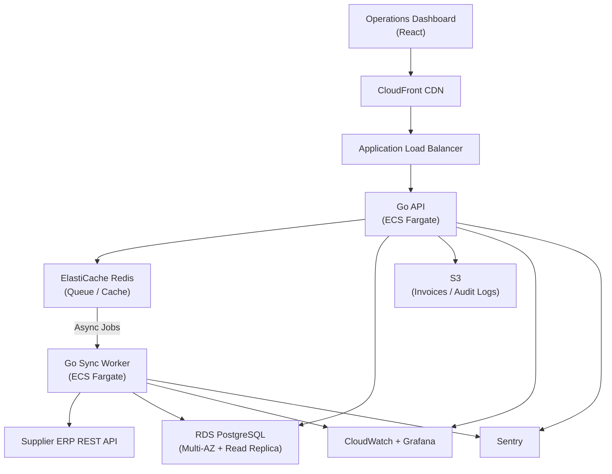

When a wholesale distributor started losing orders to manual processing errors, the cost was no longer abstract — it was visible in chargebacks, missed shipments, and staff overtime. The existing system was a patchwork of spreadsheets and a legacy desktop application that had not been updated in six years.

HunterMussel was engaged to design and deliver a **centralized inventory and order management platform** — a system that would replace manual workflows with structured automation, integrate directly with supplier ERP systems, and give warehouse staff and operations managers a single source of truth.

The project was scoped at **500 hours**. It was delivered in **340 hours**. The client paid for the actual hours worked.

## Project Context

**Client:** Mid-size wholesale distributor in the industrial supplies sector (identity protected under NDA)
**Scale:** 3 warehouse locations, 18 operations staff, approximately 400 orders processed per week
**Prior System:** Excel-based stock tracking + legacy desktop app with no API access
**Engagement Duration:** 4.5 months at 20 hours/week; completed at approximately 3 months
**Measurement Period:** Operational metrics collected across 60 days post-launch

## Development Investment

| | Estimated | Actual |
|---|---|---|
| **Hours** | 500 h | 340 h |
| **Rate** | $55 / hour | $55 / hour |
| **Total** | $27,500 | **$18,700** |
| **Client Savings** | — | **$8,800 (32% discount)** |

**Estimated phase breakdown vs. actuals:**

| Phase | Estimated | Actual | Notes |
|---|---|---|---|
| Discovery, data modeling & architecture | 45 h | 38 h | Faster alignment than expected |
| Go API — orders, inventory, supplier sync | 140 h | 95 h | Supplier ERP had a well-documented REST API; custom adapter scope dropped |
| React operations dashboard | 80 h | 55 h | Client provided detailed wireframes; no design iteration required |
| PDF report & invoice generation module | 50 h | 22 h | Mature Go PDF library handled 90% of requirements out of the box |
| Data migration from legacy system | 60 h | 38 h | Source data was cleaner than scoped; migration scripts were straightforward |
| AWS infrastructure (Terraform, ECS, RDS) | 50 h | 42 h | Reused Terraform module patterns from prior project |
| CI/CD pipeline & deployment automation | 35 h | 28 h | — |
| Observability, alerting & QA | 40 h | 22 h | — |
| **Total** | **500 h** | **340 h** | |

### Why It Came In Under Estimate

Estimates are built around uncertainty. When uncertainty resolves in the client's favor, we pass the savings on — no questions asked. Three factors drove the efficiency on this project:

1. **Supplier API quality.** The client's primary supplier operated a documented REST API with sandbox access. The original scope assumed a custom XML adapter for EDI-style integration based on what was described during discovery. The real API reduced that phase by ~45 hours.

2. **Client-provided wireframes.** The operations team had a clear mental model of their workflow and provided annotated wireframes during kickoff. This removed an entire design iteration cycle from the dashboard phase.

3. **Data quality.** Legacy data migrations are routinely scoped conservatively because source data is often inconsistent. In this case, the client's export was well-structured. The migration scripting phase finished more than 35% faster than scoped.

<!-- truncate -->

## The Challenge: Manual Workflows at Scale Break Predictably

Three structural problems were identified during the discovery phase:

1. **No Real-Time Inventory Visibility:** Stock levels were updated manually at end-of-shift, creating a window where orders could be accepted for items already depleted.
2. **Order Processing Bottleneck:** Each order required manual entry, manual supplier verification, and manual status updates — averaging 22 minutes of staff time per order.
3. **Zero ERP Integration:** Purchase orders to suppliers were sent via email, with no automated reconciliation between what was ordered and what arrived.

As order volume grew, these bottlenecks did not scale linearly — they compounded. Staff overtime increased 40% over 18 months while throughput grew only 12%.

## The Solution: Centralized Automation Layer

### 1. Real-Time Inventory Engine
Stock levels are updated on every inbound shipment scan, every order confirmation, and every return event. The system maintains a live inventory state across all three warehouse locations, with low-stock alerts triggering automated purchase order drafts for review.

### 2. Automated Order Pipeline
Order intake, validation, supplier lookup, availability confirmation, and status broadcasting are fully automated. Staff interaction is required only for exceptions — damaged goods, partial fulfillment, or customer escalations.

### 3. ERP Sync via Supplier API
The platform connects directly to the supplier's REST API, eliminating email-based purchase orders entirely. Inbound shipments are matched to open POs automatically, and discrepancies are flagged for review rather than silently absorbed.

## System Architecture

**Core Stack**
- API Layer: Go for high-throughput order and inventory operations
- Frontend: React dashboard with real-time stock and order status views
- Database: PostgreSQL with indexed order state and location tables
- Queue Layer: Redis for async supplier sync and notification jobs
- Reporting: Server-side PDF generation via Go `gofpdf` library

**Order State Machine**
Each order moves through a defined state machine:
1. Received → 2. Validated → 3. Supplier confirmed → 4. Picking → 5. Packed → 6. Dispatched → 7. Delivered

State transitions trigger automated actions: notifications, supplier API calls, inventory deductions, and invoice generation.

## Infrastructure & Deployment

**Cloud Provider:** AWS
**Compute:** ECS Fargate for Go API and background sync workers
**Database:** Amazon RDS (PostgreSQL Multi-AZ) with separate read replica for reporting queries
**Cache & Queue:** ElastiCache (Redis) for job dispatching and session management
**Object Storage:** S3 for generated PDF invoices and audit log archives
**CDN:** CloudFront for React dashboard static assets
**Networking:** VPC with private subnets for database and queue tiers
**Secrets:** AWS Secrets Manager for supplier API credentials and DB connection strings

**Deployment Pipeline**
- GitHub Actions CI/CD with unit tests, integration tests against staging RDS, and Go vet checks
- Docker images pushed to ECR on merge to main
- ECS rolling deployments with minimum healthy threshold and automatic rollback
- Terraform manages all infrastructure; staging mirrors production topology

## Observability & Monitoring

Inventory systems carry financial consequence when they fail silently. Monitoring was designed around the cost of a missed stock event or a stuck order.

**Metrics:** CloudWatch with custom metrics for order processing latency and supplier sync success rate
**Error Tracking:** Sentry capturing Go panics and React runtime errors
**Dashboards:** Grafana panels for queue depth, order pipeline throughput, and inventory event rate
**Alerting:** PagerDuty for supplier API failures, queue saturation, and orders stuck in state for more than 30 minutes
**Audit Logging:** Every inventory mutation and order state transition is logged with timestamp, user, and trigger source

## Infrastructure Diagram

## Results After 60 Days in Production

Measured against the 60-day pre-launch baseline:

- **44% Faster Order Processing:** Average staff time per order dropped from 22 minutes to 12 minutes; automated validation and supplier confirmation removed the manual steps.
- **71% Reduction in Stock Discrepancy Rate:** Real-time inventory updates eliminated the end-of-shift sync gap that caused overselling.
- **12 Hours/Week Recovered in Warehouse Operations:** Staff time previously spent on manual reorder tracking and email-based PO management was fully automated.
- **Zero Order Backlog Incidents:** In the 60-day baseline period, there were 4 backlog events caused by missed supplier confirmations. Post-launch: zero.

## On Honest Estimation

Scoping a custom software project always involves uncertainty. The responsible approach is to estimate conservatively so that clients can plan and budget with confidence — not to pad estimates for margin protection, and not to underestimate to win the work.

When a project resolves faster than estimated, the right thing to do is charge for the actual hours worked.

This project came in at 340 hours against a 500-hour estimate. The client received an invoice for $18,700 instead of $27,500. That is not a promotion or a discount code — it is how the engagement model is supposed to work.

---

**Is your operations team managing inventory in spreadsheets while the business scales around them?**

HunterMussel builds custom operational systems designed to replace manual workflows with automation that scales.

[**Request an Operations System Consultation**](https://huntermussel.com/#contact)
