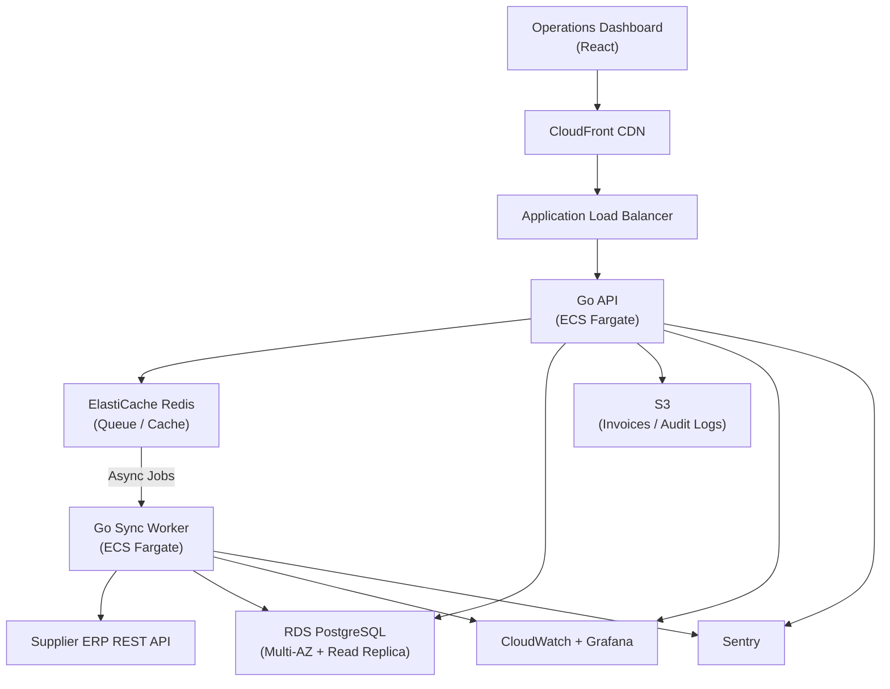

When a wholesale distributor starts losing orders to manual processing errors, the cost is no longer abstract — it shows up in chargebacks, missed shipments, and staff overtime. The existing system was a patchwork of spreadsheets and a legacy desktop application that had not been updated in six years.

HunterMussel was engaged to design and deliver a **centralized inventory and order management platform** — a system that would replace manual workflows with structured automation, integrate directly with supplier ERP systems, and give warehouse staff and operations managers a single source of truth across three locations.

## Project Context

**Client:** Mid-size wholesale distributor in the industrial supplies sector (identity protected under NDA)
**Scale:** 3 warehouse locations, 18 operations staff, approximately 400 orders processed per week
**Prior System:** Excel-based stock tracking + legacy desktop app with no API access
**Engagement Duration:** Completed in approximately 3 months at 20 hours/week
**Investment:** 340h / $18,700 at $55/h — invoiced at actual hours worked (initial estimate: 500h)
**Measurement Period:** Operational metrics collected across 60 days post-launch

## The Challenge: Manual Workflows at Scale Break Predictably

Three structural problems were identified during the discovery phase:

1. **No Real-Time Inventory Visibility:** Stock levels were updated manually at end-of-shift, creating a window where orders could be accepted for items already depleted.
2. **Order Processing Bottleneck:** Each order required manual entry, manual supplier verification, and manual status updates — averaging 22 minutes of staff time per order.
3. **Zero ERP Integration:** Purchase orders to suppliers were sent via email, with no automated reconciliation between what was ordered and what arrived.

As order volume grew, these bottlenecks compounded. Staff overtime increased 40% over 18 months while throughput grew only 12%.

<!-- truncate -->

## The Solution: Centralized Automation Layer

### 1. Real-Time Inventory Engine
Stock levels update on every inbound shipment scan, every order confirmation, and every return event. The system maintains a live inventory state across all three warehouse locations simultaneously. Low-stock thresholds trigger automated purchase order drafts for manager review — no manual monitoring required.

### 2. Automated Order Pipeline
Order intake, validation, supplier lookup, availability confirmation, and status broadcasting are fully automated. Staff interaction is required only for exceptions — damaged goods, partial fulfillment, or customer escalations. The average handling time per order dropped from 22 minutes to 12 minutes.

### 3. ERP Sync via Supplier REST API
The platform connects directly to the primary supplier's REST API, eliminating email-based purchase orders. Inbound shipments are matched to open POs automatically. Discrepancies are flagged for review rather than silently absorbed into inventory counts.

## System Architecture

**Core Stack**
- API Layer: Go — high-throughput order and inventory operations, state machine enforcement
- Frontend: React dashboard with real-time stock levels, order pipeline status, and warehouse views per location
- Database: PostgreSQL with indexed order state and multi-location inventory tables
- Queue Layer: Redis for async supplier sync jobs, notification dispatch, and report generation
- Reporting: Server-side PDF invoice and packing slip generation via Go `gofpdf`

**Order State Machine**

Each order moves through a strictly enforced state machine:

```
Received → Validated → Supplier Confirmed → Picking → Packed → Dispatched → Delivered
```

Every state transition triggers automated downstream actions: supplier API calls, inventory deductions, staff notifications, and — on dispatch — PDF invoice generation and customer email delivery.

## Infrastructure & Deployment

**Cloud Provider:** AWS
**Compute:** ECS Fargate for the Go API service and a separate Go sync worker task definition; independent scaling per service
**Database:** Amazon RDS (PostgreSQL Multi-AZ) — primary for writes, read replica for reporting and dashboard queries
**Cache & Queue:** Amazon ElastiCache (Redis) for job dispatching, order event queuing, and session management
**Object Storage:** S3 for generated PDF invoices, packing slips, and audit log archives
**CDN:** CloudFront for React dashboard static assets
**Networking:** VPC with private subnets isolating database and queue tiers from public endpoints; API exposed via Application Load Balancer
**Secrets:** AWS Secrets Manager for supplier API credentials, DB connection strings, and email delivery keys

**Deployment Pipeline**
- GitHub Actions CI/CD with Go unit tests, state machine integration tests, and `go vet` checks on every push
- Docker images tagged per commit and stored in ECR
- ECS rolling deployments with minimum healthy threshold; automatic rollback on health check failure
- Terraform manages all infrastructure resources; staging environment mirrors production topology

## Observability & Monitoring

Inventory errors carry financial consequence. A missed stock event or a stuck order is not a UX issue — it is a revenue issue. Monitoring was designed around those failure modes specifically.

**Metrics:** CloudWatch with custom metrics for order processing latency, supplier sync success rate, and inventory mutation throughput
**Error Tracking:** Sentry capturing Go API panics and React runtime errors with full stack traces
**Dashboards:** Grafana panels for order pipeline throughput, queue depth, supplier API response times, and per-location inventory event rate
**Alerting:** PagerDuty for supplier API failures, queue consumer saturation, and orders stuck in a single state for more than 30 minutes
**Audit Logging:** Every inventory mutation and order state transition is stored with timestamp, user ID, and trigger source (API, worker, or manual override)

Key dashboards tracked:
- Order pipeline throughput (orders/hour)
- Order processing latency p50 and p95
- Supplier API success rate and response latency
- Queue depth and consumer lag per worker group
- Per-location inventory event rate and low-stock alert frequency

## Infrastructure Diagram



## Results After 60 Days in Production

Measured against the 60-day pre-launch baseline:

- **44% Faster Order Processing:** Average staff time per order dropped from 22 minutes to 12 minutes — automated validation, supplier confirmation, and state transitions removed every manual step in the standard path.
- **71% Reduction in Stock Discrepancy Rate:** Real-time inventory updates eliminated the end-of-shift sync gap that had caused overselling across all three locations.
- **12 Hours/Week Recovered in Warehouse Operations:** Staff time previously consumed by manual reorder tracking, email-based PO management, and shipment reconciliation was fully automated.
- **Zero Order Backlog Incidents:** The 60-day baseline period included 4 backlog events caused by missed supplier confirmations. Post-launch: zero incidents across the same 60-day window.

---

**Is your operations team managing inventory in spreadsheets while the business grows around them?**

HunterMussel builds custom operational platforms designed to replace manual workflows with automation that scales.

[**Request an Operations System Consultation**](https://huntermussel.com/#contact)
