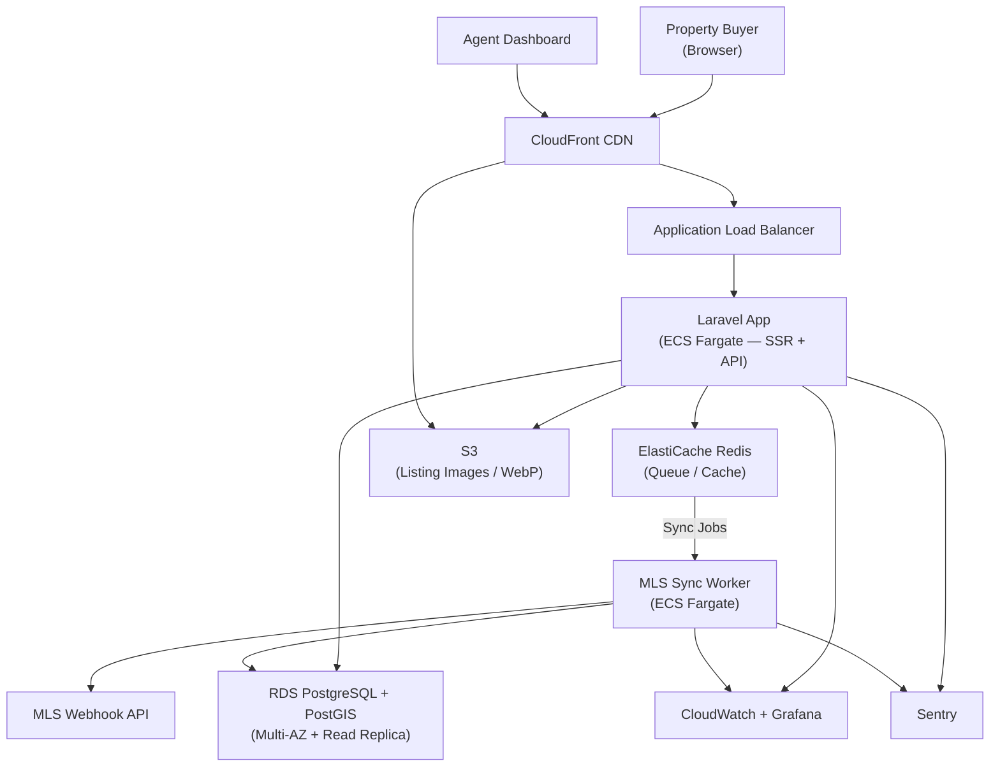

A regional real estate agency was running their listings on a generic WordPress theme. Search was powered by a plugin that did not support map-based browsing, filter combinations were limited, and the mobile experience had a Lighthouse score of 31. Organic traffic was declining while competitor portals — purpose-built for property search — absorbed it.

HunterMussel was engaged to build a **purpose-built real estate listing portal** with geospatial property search, MLS data feed integration, and a performance architecture designed for SEO. The project was scoped at **480 hours**. It was delivered in **310 hours**. The client paid for actual hours.

## Project Context

**Client:** Regional real estate agency operating across 3 counties (identity protected under NDA)
**Scale:** 6 licensed agents, approximately 280 active listings, 12,000 monthly site visits on prior platform
**Prior Stack:** WordPress with a listing plugin; $220/month in managed hosting; Lighthouse score of 31
**Engagement Duration:** 4 months at 20 hours/week; completed at approximately 2.5 months
**Measurement Period:** SEO and performance data tracked across 90 days post-launch

## Development Investment

| | Estimated | Actual |
|---|---|---|
| **Hours** | 480 h | 310 h |
| **Rate** | $55 / hour | $55 / hour |
| **Total** | $26,400 | **$17,050** |
| **Client Savings** | — | **$9,350 (35% discount)** |

**Estimated phase breakdown vs. actuals:**

| Phase | Estimated | Actual | Notes |
|---|---|---|---|
| Discovery, architecture & data modeling | 40 h | 32 h | — |
| MLS feed ingestion & property sync service | 90 h | 48 h | MLS feed had a clean REST webhook API; polling/scraping approach not needed |
| Geospatial search (PostGIS + map UI) | 85 h | 45 h | PostGIS radius + bounding box queries proved simpler than scoped |
| Laravel backend — listings, agents, auth | 100 h | 68 h | — |
| Frontend — search UI, listing pages, map | 70 h | 52 h | Client-provided Figma files eliminated design iteration phase entirely |
| Image optimization pipeline | 35 h | 14 h | Pipeline reused directly from a prior static site project |
| AWS + Cloudflare infrastructure & CDN config | 30 h | 22 h | — |
| CI/CD pipeline & deployment automation | 15 h | 14 h | — |
| QA, SEO audit & performance validation | 15 h | 15 h | — |
| **Total** | **480 h** | **310 h** | |

### Why It Came In Under Estimate

Three factors resolved in the client's favor during development:

1. **MLS feed quality.** The original scope assumed we would need to build a polling or scraping layer for the Multiple Listing Service data. The MLS provider the agency used operated a documented REST webhook API with sandbox access. The data ingestion phase was reduced from 90 to 48 hours as a result.

2. **PostGIS simplicity.** Geospatial search on a real estate portal can range from straightforward radius queries to complex polygon-based zoning filters. For this client's requirements, PostGIS radius and bounding-box queries with a standard GiST index covered 100% of the use cases — no custom spatial logic required. The map UI integration using Mapbox GL was also significantly faster than the pessimistic estimate.

3. **Pixel-perfect Figma files.** One of the biggest sources of frontend hours on client projects is design iteration — moving through wireframes, reviewing mockups, and adjusting layouts mid-development. This client's in-house designer provided complete Figma files at kickoff, covering every page state. The design phase was eliminated entirely, and development proceeded directly from the files.

<!-- truncate -->

## The Challenge: Generic Platforms Cannot Win on SEO or UX

Three core limitations were identified on the prior platform:

1. **No Geospatial Search:** Users could filter by city or zip code, but not draw a search area on a map or filter by commute radius — a baseline expectation on modern property portals.
2. **Poor Core Web Vitals:** The Lighthouse score of 31 indicated heavy plugin scripts, unoptimized images, and render-blocking resources. Google's Page Experience signals were working against organic visibility.
3. **No Structured Data:** Property listings lacked Schema.org markup, meaning they did not qualify for rich result treatment in Google Search (price, availability, address displayed directly in SERPs).

The combination of poor UX and weak technical SEO had allowed competitor portals to rank above the agency on local property searches despite the agency having more listings.

## The Solution: Purpose-Built for Property Search and SEO

### 1. Geospatial Property Search
The platform implements three search modes:

- **Radius search:** Enter an address and a distance; returns all listings within that radius using PostGIS `ST_DWithin`.
- **Map bounding box:** As the user pans and zooms, listings update to match the visible map region using PostGIS `ST_MakeEnvelope`.
- **Filter combination:** Bedrooms, price range, property type, and listing date stack with either spatial mode.

Search results update in real time without full page reloads.

### 2. Automated MLS Feed Sync
A background sync worker polls the MLS webhook API every 15 minutes. New listings are ingested automatically, price changes are applied, and sold listings are archived — all without agent intervention. Agents manage their own listing notes and media attachments through a separate agent dashboard.

### 3. Performance and SEO Architecture
Each listing page is server-side rendered by Laravel for crawlability and fast initial paint. Static assets are served through CloudFront. Images are processed at upload time into WebP with responsive `srcset` variants.

Schema.org `RealEstateListing` structured data is injected into every property page, covering price, address, property type, geo-coordinates, and availability status.

## System Architecture

**Core Stack**
- Backend: Laravel (server-side rendered listing pages + JSON API for search)
- Geospatial: PostgreSQL with PostGIS extension; GiST spatial index on listing coordinates
- Frontend: Vanilla JS + Mapbox GL JS for map interactions; minimal JavaScript bundle
- Database: PostgreSQL with PostGIS
- Queue Layer: Redis for async MLS sync jobs and image processing
- Image Processing: Laravel job pipeline converting uploads to WebP/AVIF with multiple sizes

**Search Request Flow**
1. User submits search parameters (location, radius or bbox, filters)
2. Laravel validates and normalizes inputs
3. PostGIS spatial query runs against indexed coordinates
4. Results returned as JSON; map markers and listing cards update without page reload
5. Each listing card links to a server-side rendered detail page for SEO

## Infrastructure & Deployment

**Cloud Provider:** AWS + Cloudflare CDN
**Compute:** ECS Fargate for the Laravel application and MLS sync worker
**Database:** Amazon RDS (PostgreSQL Multi-AZ) with PostGIS extension installed; read replica for search queries
**Cache & Queue:** ElastiCache (Redis) for job dispatching and query result caching
**Object Storage:** S3 for listing images and WebP variants
**CDN:** CloudFront for image delivery and static assets; edge caching for listing detail pages
**Networking:** VPC with private subnets for database and queue tiers; ALB for the Laravel service
**Secrets:** AWS Secrets Manager for MLS API credentials and DB connection strings

**Deployment Pipeline**
- GitHub Actions CI/CD with Laravel PHPUnit tests and PostGIS query integration tests
- Docker images pushed to ECR; ECS rolling deployments with health checks
- Terraform manages infrastructure; staging environment mirrors production with a copy of production data (anonymized)
- Lighthouse CI runs post-deploy against 10 representative listing URLs; pipeline fails if any score drops below 90

## Observability & Monitoring

**Metrics:** CloudWatch with custom metrics for MLS sync success rate, search query latency, and image processing queue depth
**Error Tracking:** Sentry for PHP exceptions and JavaScript errors
**Dashboards:** Grafana panels for search latency (p50, p95), queue throughput, and CDN cache hit rate
**Log Aggregation:** CloudWatch Logs with structured logs per request; MLS sync events logged with property ID and change type
**Alerting:** PagerDuty for MLS sync failures (stale listing data risk), queue saturation, and database replica lag

Key dashboards tracked:
- Search query p95 latency (target: < 300ms)
- MLS sync lag (time since last successful feed update)
- CDN cache hit rate per content type
- Core Web Vitals per page template (Lighthouse CI weekly)

## Infrastructure Diagram

## Results: 90 Days Post-Launch

Measured against the 90-day pre-launch baseline on the prior WordPress platform:

- **Lighthouse Performance Score: 96** (up from 31 on the prior WordPress install)
- **LCP improved from 4.8s to 0.9s:** Server-side rendering, optimized images, and CloudFront CDN eliminated the bottlenecks that penalized the prior platform.
- **62% Increase in Organic Search Impressions:** Structured data markup qualified listing pages for rich result treatment; combined with improved Core Web Vitals, the agency ranked on the first page for 18 additional local property search queries within 90 days.
- **3.1× Increase in Map Search Usage:** Usage analytics showed that 68% of search sessions used the map mode within the first 30 days — a feature the prior platform did not offer at all.
- **Hosting Cost Reduced from $220/month to $38/month:** Migrating from a managed WordPress host to ECS Fargate + CloudFront reduced infrastructure costs by 83% while improving performance.

## On Honest Estimation

The original 480-hour estimate was built on what we knew and what we did not know at the time of scoping. The MLS integration was scoped conservatively because feed quality varies significantly across providers. The geospatial work was estimated with buffer because spatial query complexity is hard to predict before seeing the actual data shape.

Both resolved in the client's favor. The project was delivered in 310 hours.

We invoiced for 310 hours at $55/hour: **$17,050 instead of $26,400.**

There is no mechanism for retroactively charging the original estimate when a project finishes under scope. The estimate exists to help clients plan, not to establish a ceiling that we bill toward regardless of actual effort.

---

**Is your property listings platform losing organic search ground to purpose-built competitors?**

HunterMussel builds high-performance web platforms engineered for search visibility, speed, and conversion.

[**Request a Platform Consultation**](https://huntermussel.com/#contact)
