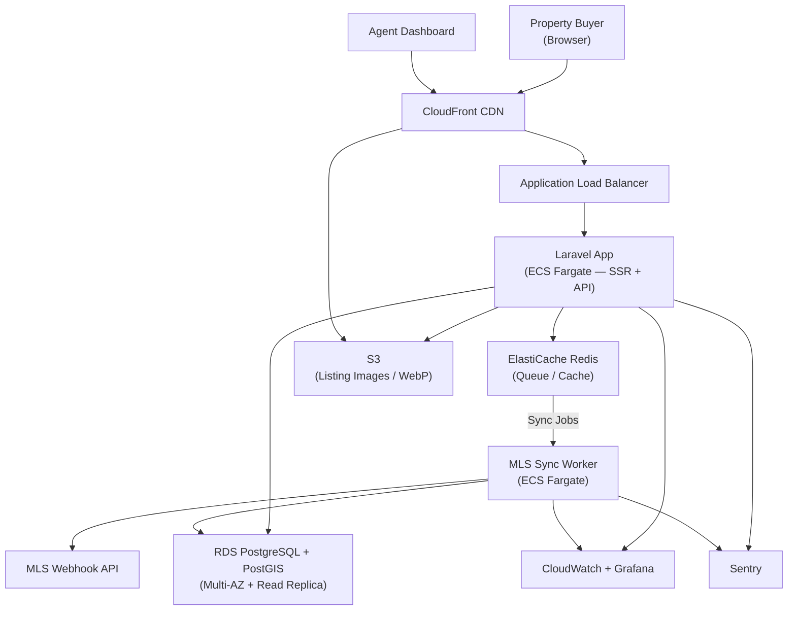

A regional real estate agency was running their listings on a generic WordPress theme. Search was powered by a plugin that did not support map-based browsing, filter combinations were limited, and the mobile experience had a Lighthouse score of 31. Organic traffic was declining while competitor portals — purpose-built for property search — absorbed it.

HunterMussel was engaged to build a **purpose-built real estate listing portal** with geospatial property search, automated MLS data feed sync, and a performance architecture designed for SEO and conversion.

## Project Context

**Client:** Regional real estate agency operating across 3 counties (identity protected under NDA)
**Scale:** 6 licensed agents, approximately 280 active listings, 12,000 monthly site visits on prior platform
**Prior Stack:** WordPress with a listing plugin; $220/month in managed hosting; Lighthouse score: 31
**Engagement Duration:** Completed in approximately 2.5 months at 20 hours/week
**Investment:** 310h / $17,050 at $55/h — invoiced at actual hours worked (initial estimate: 480h)
**Measurement Period:** SEO and performance data tracked across 90 days post-launch

## The Challenge: Generic Platforms Cannot Compete on SEO or UX

Three core limitations were identified on the prior platform:

1. **No Geospatial Search:** Users could filter by city or zip code, but could not draw a search area on a map or search by commute radius — a baseline expectation on modern property portals.
2. **Poor Core Web Vitals:** A Lighthouse score of 31 reflected heavy plugin scripts, unoptimized images, and render-blocking resources. Google's Page Experience signals were working against organic visibility.
3. **No Structured Data:** Property listings had no Schema.org markup, disqualifying them from rich result treatment in Google Search — competitor portals were showing price, address, and availability directly in SERPs.

The combination of poor UX and weak technical SEO allowed competitor portals to outrank the agency on local property searches despite the agency having more listings.

<!-- truncate -->

## The Solution: Purpose-Built for Property Search and SEO

### 1. Geospatial Property Search
The platform implements three search modes backed by PostGIS:

- **Radius search:** Enter an address and distance; returns listings within that radius using `ST_DWithin` against a GiST-indexed coordinate column.
- **Map bounding box:** As the user pans and zooms the map, listings update dynamically using `ST_MakeEnvelope` on the visible viewport.
- **Layered filters:** Bedrooms, price range, property type, and listing date stack with either spatial mode without degrading query performance.

Search results update in real time without full page reloads. Each listing card links to a server-side rendered detail page for SEO crawlability.

### 2. Automated MLS Feed Sync
A background worker syncs with the MLS provider's webhook API every 15 minutes. New listings are ingested automatically, price changes are applied, and sold listings are archived — without any agent action required. Agents manage listing notes, media attachments, and custom descriptions through a separate authenticated dashboard.

### 3. Performance and SEO Architecture
Listing detail pages are server-side rendered by Laravel for fast initial paint and full crawlability. Images are processed at upload time into WebP and AVIF formats with responsive `srcset` variants, served through CloudFront from S3.

Schema.org `RealEstateListing` structured data is injected into every property page: price, address, property type, geo-coordinates, and availability status. Lighthouse CI runs post-deploy and fails the pipeline if any score drops below 90.

## System Architecture

**Core Stack**
- Backend: Laravel — server-side rendered listing pages + JSON API for dynamic search responses
- Geospatial: PostgreSQL with PostGIS extension; GiST spatial index on listing coordinates
- Map Layer: Mapbox GL JS for interactive map with custom listing markers; minimal JS bundle
- Queue Layer: Redis for async MLS sync jobs, image processing pipeline, and search result caching
- Image Processing: Laravel job pipeline converting uploads to WebP/AVIF with multiple responsive sizes

**Search Request Flow**
1. User submits parameters (location input or map viewport, filters)
2. Laravel validates and normalizes spatial inputs
3. PostGIS spatial query executes against GiST-indexed coordinate column
4. Results returned as JSON; map markers and listing cards update without page reload
5. Clicking a listing navigates to a server-side rendered SSR page with full structured data

## Infrastructure & Deployment

**Cloud Provider:** AWS + Cloudflare CDN
**Compute:** ECS Fargate for the Laravel application service and a separate MLS sync worker task; independent scaling per service
**Database:** Amazon RDS (PostgreSQL Multi-AZ) with PostGIS extension; read replica dedicated to search query traffic
**Cache & Queue:** Amazon ElastiCache (Redis) for job dispatching, search result caching, and session management
**Object Storage:** S3 for listing images and all WebP/AVIF size variants
**CDN:** CloudFront for image delivery, static assets, and edge-cached listing detail pages
**Networking:** VPC with private subnets for database and queue tiers; Laravel service exposed via Application Load Balancer
**Secrets:** AWS Secrets Manager for MLS API credentials and DB connection strings

**Deployment Pipeline**
- GitHub Actions CI/CD with PHPUnit test suite and PostGIS spatial query integration tests
- Docker images pushed to ECR; ECS rolling deployments with health checks and automatic rollback
- Terraform manages all infrastructure; staging mirrors production with anonymized copy of production data
- Lighthouse CI runs post-deploy against 10 representative listing page URLs; pipeline fails if any score drops below 90

## Observability & Monitoring

**Metrics:** CloudWatch with custom metrics for MLS sync success rate, search query latency, and image processing queue depth
**Error Tracking:** Sentry for PHP exceptions and JavaScript runtime errors
**Dashboards:** Grafana panels for search latency (p50, p95), MLS sync lag, queue throughput, and CDN cache hit rate per content type
**Log Aggregation:** CloudWatch Logs with structured request logs; MLS sync events logged with property ID, change type, and processing duration
**Alerting:** PagerDuty for MLS sync failures (stale data risk), queue saturation, and database replica lag exceeding threshold

Key dashboards tracked:
- Search query latency p50 and p95 (target: p95 < 300ms)
- MLS sync lag — time since last successful feed update
- CDN cache hit rate per content type (target: > 95% for listing images)
- Core Web Vitals per page template tracked weekly via Lighthouse CI

## Infrastructure Diagram

## Results: 90 Days Post-Launch

Measured against the 90-day pre-launch baseline on the prior WordPress platform:

- **Lighthouse Performance Score: 96** — up from 31 on the prior WordPress install, validated by Lighthouse CI on every production deployment.
- **LCP improved from 4.8s to 0.9s:** Server-side rendering, WebP image delivery, and CloudFront edge caching eliminated the render bottlenecks that penalized the prior platform in Core Web Vitals.
- **62% Increase in Organic Search Impressions:** Structured data markup qualified listing pages for rich results in Google Search; combined with improved Core Web Vitals signals, the agency ranked on the first page for 18 additional local property search queries within 90 days.
- **3.1× Increase in Search Engagement:** Usage data showed 68% of search sessions used the map mode within the first 30 days — a capability the prior platform did not offer.
- **Hosting Cost Reduced from $220/month to $38/month:** Migrating from managed WordPress hosting to ECS Fargate + CloudFront reduced infrastructure costs by 83% while delivering higher availability and significantly better performance.

---

**Is your listings platform losing organic search ground to purpose-built competitors?**

HunterMussel builds high-performance web platforms engineered for search visibility, speed, and conversion from the first line of code.

[**Request a Platform Consultation**](https://huntermussel.com/#contact)
