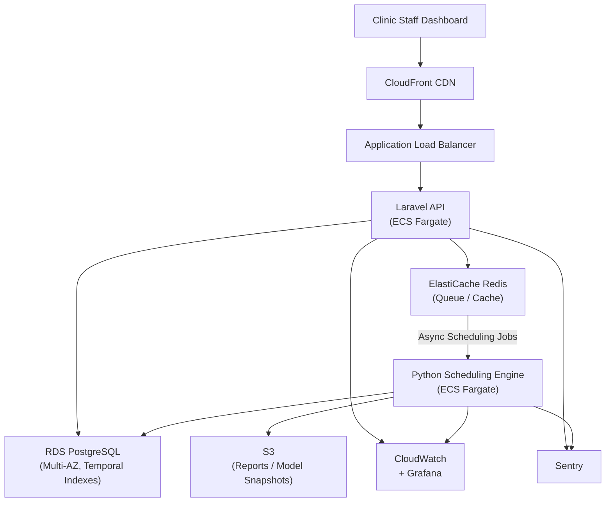

Dental clinics operate on precision timing. Each missed slot, delay, or overbooking affects revenue, patient satisfaction, and staff workload simultaneously. Traditional scheduling systems treat appointments as static entries in a calendar, ignoring the dynamic nature of real-world operations.

In this project, HunterMussel engineered an **intelligent scheduling and resource optimization platform** tailored for dental clinics. The objective was to convert manual planning into an automated system capable of predicting demand, optimizing chair allocation, and coordinating staff schedules in real time.

## The Operational Gap: Static Calendars vs. Dynamic Clinics

An analysis of existing workflows revealed three structural inefficiencies:

1. **Rigid Appointment Logic:** Fixed-duration bookings failed to account for procedure variability.
2. **Underutilized Resources:** Chairs, assistants, and equipment were often idle due to poor allocation logic.
3. **Reactive Management:** Staff adjustments occurred only after delays happened, not before.

As patient volume increased, these inefficiencies scaled into scheduling conflicts, overtime costs, and lost appointment opportunities.

<!-- truncate -->

## The Solution: Predictive Scheduling Engine

Rather than improving manual scheduling, we replaced it with a decision system designed to optimize clinic operations continuously.

### 1. Adaptive Appointment Allocation
The system analyzes historical treatment data to estimate realistic procedure durations. Instead of assigning fixed time blocks, it dynamically allocates slots based on:

- Procedure type
- Dentist speed profile
- Patient history
- Equipment requirements

This reduces idle gaps and prevents cascading delays.

### 2. Resource Coordination Layer
Appointments are treated as multi-resource events. The engine automatically ensures availability of:

- Dental chairs
- Assistants
- Specialized tools
- Rooms

If a constraint conflict occurs, the system proposes optimized alternatives instantly.

### 3. Predictive Demand Modeling
Using time-series forecasting, the platform anticipates peak booking periods and adjusts availability rules accordingly. Clinics can preemptively extend hours or assign additional staff before demand spikes occur.

## System Architecture

The platform was designed to operate with real-time responsiveness and modular extensibility.

**Core Stack**
- Backend: Laravel API for structured business logic
- Optimization Engine: Python microservices for prediction and scheduling logic
- Database: PostgreSQL with temporal scheduling indexes
- Queue System: Redis for async scheduling calculations
- Frontend: Reactive dashboard for staff coordination

**Decision Pipeline**
Each scheduling action passes through a computation sequence:

1. Input validation
2. Constraint analysis
3. Resource matching
4. Conflict simulation
5. Optimization scoring
6. Final slot assignment

This ensures that every scheduled appointment is mathematically optimal within existing constraints.

## Infrastructure & Deployment

The platform was deployed on AWS with a managed container stack designed to meet healthcare-grade reliability requirements without over-engineering a relatively focused workload.

**Cloud Provider:** AWS
**Compute:** ECS Fargate for the Laravel API and Python scheduling engine; separate task definitions allow independent scaling
**Database:** Amazon RDS (PostgreSQL Multi-AZ) with temporal indexing for appointment windows and resource timelines
**Cache & Queue:** Amazon ElastiCache (Redis) for async scheduling jobs and session caching
**Object Storage:** S3 for historical scheduling reports and model snapshots
**CDN:** CloudFront for clinic dashboard static assets
**Networking:** VPC with private subnets for database and scheduler tiers; API exposed via Application Load Balancer
**Secrets:** AWS Secrets Manager for database credentials and external calendar integration tokens

**Deployment Pipeline**
- GitHub Actions CI/CD with automated unit tests, constraint solver validation, and database migration checks
- Docker images per service pushed to ECR on merge to main
- ECS rolling deployments with minimum 100% healthy threshold to avoid scheduling downtime
- Terraform manages environment infrastructure; staging environment mirrors production topology

## Observability & Monitoring

Scheduling errors have direct patient impact. Monitoring was configured to surface conflicts or optimization degradation immediately, before clinic staff encounter problems.

**Metrics:** CloudWatch with custom metrics for scheduling decision latency and constraint conflict rate
**Error Tracking:** Sentry capturing exceptions from both Laravel and Python microservices
**Dashboards:** Grafana dashboards showing queue throughput, slot assignment latency, and resource utilization per clinic
**Log Aggregation:** CloudWatch Logs with structured per-request logs; log groups isolated per clinic tenant
**Alerting:** SNS-based alerts for queue saturation, optimization timeout, and failed slot assignments; on-call rotation via PagerDuty
**Regression Checks:** Daily synthetic scheduling job validates constraint solver output against known fixture data; failures trigger immediate alert

Key dashboards tracked:
- Scheduling decision latency (p50, p95)
- Queue depth per clinic
- Daily conflict rate (scheduling overlaps detected and resolved)
- Chair utilization rate across active clinics
- Optimization scoring accuracy over time

## Infrastructure Diagram

## Measurable Results After Deployment

Within months of production use, clinics reported operational improvements:

- **31% Increase in Chair Utilization:** Idle time reduced through intelligent allocation.
- **42% Fewer Scheduling Conflicts:** Automated constraint validation prevented overlaps.
- **Reduced Administrative Workload:** Reception staff spent significantly less time managing calendars.
- **Higher Patient Throughput:** More appointments completed without extending working hours.

## Why Intelligence Matters in Healthcare Scheduling

Healthcare environments contain more variables than typical scheduling systems can handle manually. Each appointment involves time, personnel, equipment, and patient-specific factors.

An intelligent scheduling system converts these variables into a solvable optimization model, enabling:

- Predictive planning
- Real-time adjustments
- Resource efficiency
- Operational stability

Instead of reacting to problems, clinics prevent them.

## Conclusion: Scheduling Is an Optimization Problem

Clinic performance is not determined solely by medical expertise. Operational efficiency plays a critical role in scalability and patient satisfaction.

By replacing static calendars with a predictive scheduling engine, this platform transformed clinic coordination into a continuously optimized system — improving utilization, reducing stress, and increasing revenue capacity without increasing staff.

---

**Is your clinic schedule limiting your growth capacity?**

HunterMussel builds intelligent operational platforms that automate decisions, optimize resources, and scale healthcare systems efficiently.

[**Request a System Consultation**](https://huntermussel.com/#contact)